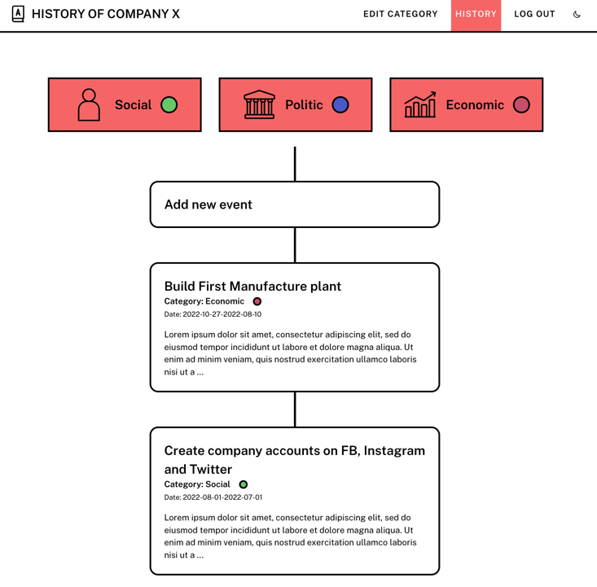

## Exercise
Create simple system which allows to save in a timeline events. The example can be history of Company

### Presentation
* [Youtube presentation movie](https://youtu.be/fg9gmwixJmU)

### Technologies:
* Python3
  * Flask
  * SQLAlchemy
* Poetry 
* PostgreSQL
* Jinja2
* HTML5
* CSS3

### Business requirements
* Events have 
  * Name
  * End date and Start date
  * Long description
  * Graphic illustration 
  * Category
* Categories have
  * Name
  * Color
  * Icon
* Allowed operation on events and categories:
  * create
  * edite
  * remove
* Not logged-in user can only see events, without possibility of do anything 

### Functional requirements
* Use Relational Database
* Security
  * Passwords store in database as hashes
  * CSRF Protection
  * SQL Injection